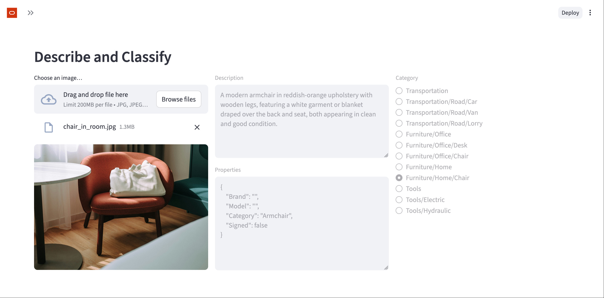

# Describe and Classify Images with AI

This demo allows you to upload images and generate short descriptions, as well
as categorizing the main object(s) and generating a JSON with properties.

### Applications

- Classifying objects for insurance purposes
- Pre-populating data for sales portals
- Automatic metadata generation for image galleries

## Requirements

When deploying this demo on your local machine, the requirements are fairly basic:

- Access to the OCI Generative AI service in the `us-chicago-1` region to use Grok-4
- A configuration file for the OCI SDK as per
  instructions](https://docs.oracle.com/en-us/iaas/Content/API/Concepts/sdkconfig.htm)
- Python and [`uv`](https://docs.astral.sh/uv/) or another Python package manager

## Setup

1. Set up a virtual environment, for example with `uv`:
   ```console
   uv venv
   uv pip install -r requirements.txt
   ```
   The resulting virtual environment will be in `.venv` in the local directory.
2. Run the application:
   ```console
   uv run streamlit run demo.py
   ```
   This should open a page with the application in your browser. Alternatively,
   Streamlit will also print a link in your terminal to open the application.

## Technical Details
The solution leverages the OCI Generative AI Service to execute several prompts to extract:

- A short description
- Best-fit category based on user-specified categories
- Populating a user-modifiable JSON template

The prompts are contained in separate files for easy tuning, and may have to be
adapted when switching the underlying LLM.

This demo is pre-configured to use Grok-4, which proved to be best fit to
handle images this way.

## Output

The demo will display an interactive dashboard to upload an image and process
it, displaying a short description, filled out JSON template, and a category
match.

## Authors

- Matthias Wolf

## Contributing

We welcome contributions to improve and expand the capabilities of this demo.
Please fork the repository and submit a pull request with your changes.

## License
Copyright (c) 2025 Oracle and/or its affiliates.
 
Licensed under the Universal Permissive License (UPL), Version 1.0.
 
See [LICENSE](../LICENSE) for more details.
