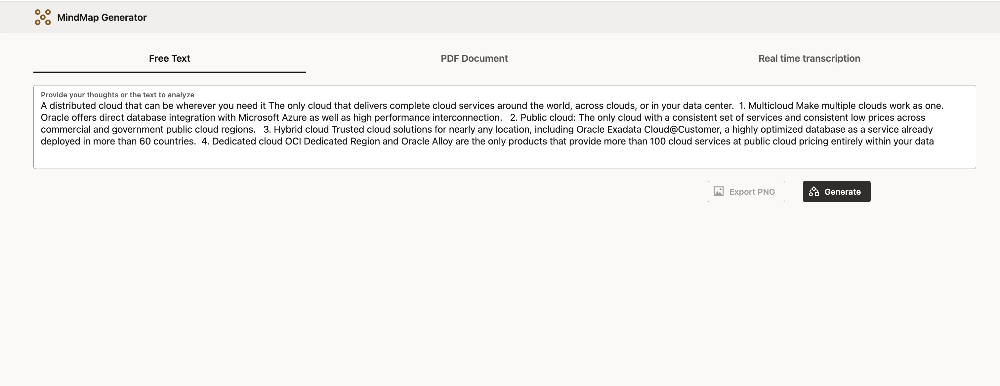

# MindMapGenerator using OCI Generative AI & Visual Builder

MindMapGenerator, can take a text, analyze it, classify it into levels and sublevels, and generate a structured mind map based on the content using Generative AI. It also works with PDF documents by leveraging Oracle Document Understanding to analyze and extract information from the file before creating the mind map. Additionally, the demo can capture information in real-time using the Speech service, processing spoken input to generate an insightful and organized mind map on the fly. Can be complementary to AI Meetings or other different use cases.

Reviewed: 17.12.2024
 
# **1. Prepare your user**
   
   In Oracle Cloud Infrastructure (OCI), API keys are used for secure authentication when accessing OCI resources through REST APIs. OCI API keys consist of two parts: a Public key and a Private key. You use the OCI console to generate the Private/Public key pair.
   Generate API Keys using OCI Console
    To Generate the API Keys using OCI Console:

  - Login into your OCI Account.
   ![alt text]
  - Click on the Profile icon at the top-right corner and select your Profile hyperlink.
   
  - Under Resources section at the bottom-left, select API Keys and then click Add API Key.
   
  - The Add API Key dialog is displayed. Select Generate API Key Pair to create a new key pair.
  
  - Click Download Private Key. A .pem file is saved to your local device. You do not need to download the public key and click Add button.
  
  

# **2.Pick you compartment**
Identify the compartment you're currently working within. Navigate to 'Identity' -> 'Compartments'. Locate your compartment and make a note of its OCID (Oracle Cloud Identifier)

# **3.Open Visual Builder**
## Import Visual Builder project
* Open Visual Builder and click on the "Import" button. Choose "Application from file".
* Drop the zip project file
* Provide a name and an ID, for example "MindMaps_Generator". Click on Import button.

  
## Configure REST APIs authentication
* Open the recently created project.
 
* Click on Services button (left side) and click on "Backends"
 
* Now, click on GenAI, and Servers to edit server authentication.
* Click the pencil to provide the OCI Crendentials
* Provide the crendentials you got during the step 1.
 

* Repeat the same process with the GenAI backend.

## Provide your compartmentId and all the required variables
* Provide compartmentId default value in the project variable named "compartmentID" that you got during the step 2.
 
Repeat the process with bucketName, cohereModel,namespace & prefix

## Provide JS libray to generate MindMaps
* I developed this sample using go.js but you can replace by any other. Please update the html page in the application providing your library

#  **4.Preview the application**
* Now can provide a topic in the text area and click "generate" button. 
 

* Automatically a mindmap will be created. 
  

## Notes
* It is important to note that, you can use any open source or licensed JS library to generate the MindMap. And you can do using Free Text & Documents Analysis. If you want to use Real Time Transcription you need to configure a Speech Bridge and modify the JS page.

## I hope you liked it.
Author: Jesús Brasero
 
# License
 
Copyright (c) 2025 Oracle and/or its affiliates.
 
Licensed under the Universal Permissive License (UPL), Version 1.0.
 
See [LICENSE](https://github.com/oracle-devrel/technology-engineering/blob/main/LICENSE) for more details.
