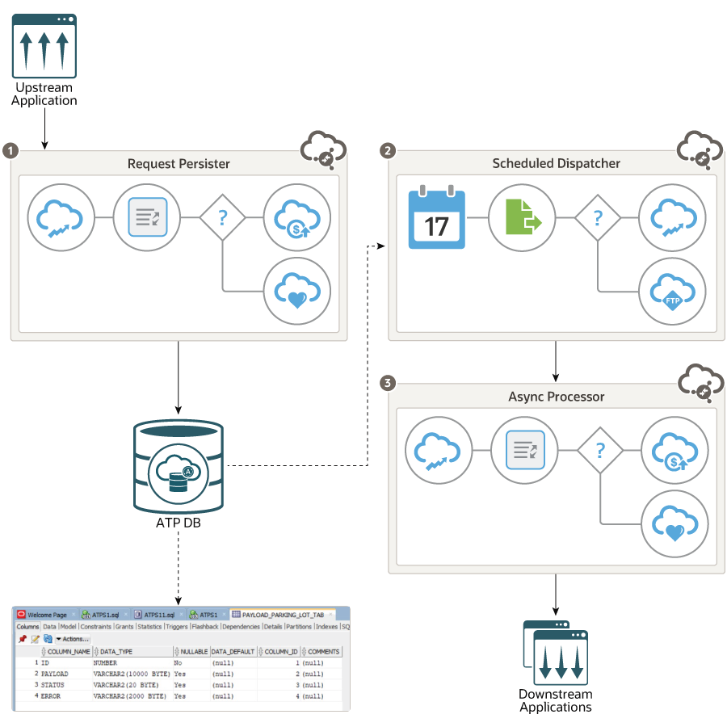
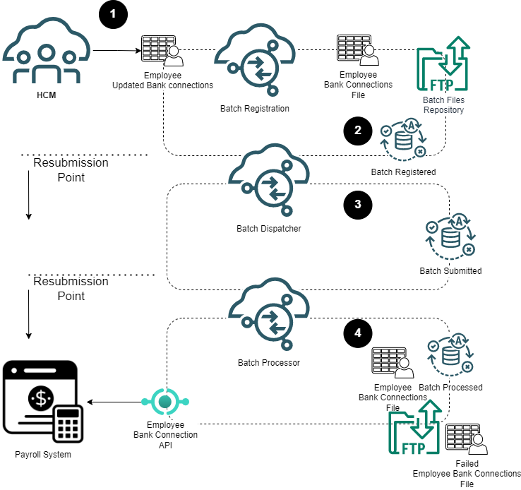

# cloud.asset.integration-oic-parkinglotpattern-batch

## Introduction

In this Project, we will illustrate a simple practical example of using the parking lot pattern with Oracle Integration Cloud (OIC) and batch processing style.
The example will use Autonomous Transaction Processing ([ATP]((https://docs.oracle.com/en/cloud/paas/atp-cloud/index.html))) database for a parking lot table.

This project implements extension of the Resilient Asynchronous Integrations suitable for processing, managing and monitoring pattern based batch style integrations. 

The solution is build as the project for [OIC Gen3](https://docs.oracle.com/en-us/iaas/application-integration/index.html). The solution artifacts contains [cloud.asset.integration-oic-parkinglotpattern](https://github.com/oracle/cloud-asset-integration-oic-parkinglotpattern-sample) artifacts migrated to OIC Gen3 as well.

Refer to the blog - [OIC Advanced Error Handling ](https://www.ateam-oracle.com/advanced-error-handling-oic), for a detailed discussion of the Integration design pattern and solution.

Refer to best practice article - [Best practices for building resilient asynchronous integrations](https://docs.oracle.com/en/solutions/best-practices-resilient-asynch-integrations/index.html#GUID-B18DDA79-78FD-4767-BEE6-DB213B5EC073).

The repository provides the OIC Gen3 sample integrations and ATP scripts required for the implementation described in the blog.

## How to Install and Run
* Download the Car file (within zip archives) from this project and import into target OIC Gen3 environment
* Configure the required connections and activate the integrations
* Download the parking lot table creation DDL script file and execute on target database.
* Refer to the blog - [OIC Advanced Error Handling ](https://www.ateam-oracle.com/advanced-error-handling-oic), for more detailed instructions.

### High Level Design 
 Figure below shows the high level design of solution using OIC flows and [ATP DB](https://docs.oracle.com/en/cloud/paas/atp-cloud/index.html) for parking lot table. The OIC solution use Persister, Dispatcher and Processor flows.
 
 

  **Batch processing scenario** is implemented to reflect following processing steps:
  1. HCM produces CSV File with Employee Bank Connection Information
  2. Batch “Requestor” integration flow will download file from source e.e.g. File Server/Storage/UCM and Register the Batch Information (opt. de-batch)
  3. Batch Dispatcher will select from the parked batches which process is ready to start and submits batch
  4. Batch Processor process the CSV File and documents processing, handles error in Payroll API provisioning and Notifies Result

 

 ### Solution Components
The [Parking Lot pattern](https://www.ateam-oracle.com/oic-error-handling-guide) here uses an ATP table to store request metadata and status information. The OIC Flows in the design are inherited from the original OIC Gen2 resilient services
 * Request Persister
 * Scheduled Dispatcher
 * Async Processor

**For the resilient batch processing additional OIC Flows added**
 * Batch Requests Persister responsible for the Batch Registration and parking the processing
  *SR_BulkDownload_RequestPersister_ATP*
     - Batch Request Registration Provider template schedulable service which scans "Remote FTP Server, transfers the batch CSV file to Local FTP and registers/parks the Batch in the ATP Parking Lot Table.

 * Batch Dispatcher for CSV Batch responsible for the submitting the best candidate from the registered and parked batches
  *SR_ScheduledDispatcher_CSVBatch*
     - Dispatcher fetches all the ready/parked batches for the CSV Batch Group Type and triggers one way batch processors. Updates Batch Status to Submitted

 * Async Batch Processor responsible for the batch processing in our case it is HCM To Payroll provisioning
   *SR_OneWay_Processor_HCM_To_Payroll*
   - Example of the one-way processor that processes all the submitted batch rows. In this case it it is example of HCM Bank Connections to Payroll. It invokes Payroll Mock Service which represents Payroll API for the employee bank connection

 * Resubmission Processor for the fixed and ready payloadsprovisioning

   *SR_ScheduledDispatcher_PayrollErrors*
   - Example of the Resubmission Endpoint for the Failed processed rows from the Batch processing. It fetches READY state records form the Failed Payloads table and invokes the row processing service.

 
### Artifacts:

#### DDL script for ATP table
Parking lot table creation DDL script for sample 

#### OIC Flows - Integration Archive - OIC Gen3 Project File (CAR)
Download the CAR file from this project and import into target OIC environment. Configure the required connections before the integrations activation

#### sample account json file
Sample json file for a simple account creation request - resilient single payload service

#### sample csv files 
Sample csv files for demonstrating batch with/without errors

#### opaque schema file
XSD schema file used for persisting json payload into Db parking lot table using Stage file
 
Refer to the blog - [OIC Advanced Error Handling ](https://www.ateam-oracle.com/advanced-error-handling-oic), for a detailed discussion of the Integration design pattern and solution.

Refer to the blog - [Batch to API - Design for Resiliency Using Oracle Integration](https://www.linkedin.com/posts/ingpeterobert_oic-parkingabrlot-oraclecloud-activity-7065351235192680449-8Bk2?utm_source=share&utm_medium=member_desktop), for the resilient batch metamodel.

## Payload examples of the last mile API - Batch processor and Payroll Bank Connection API

### ./payloads/hcm_bnk_connsX4long.csv - sample file which should pass with no errors

### ./payloads/hcm_bnk_connsNoError4long.csv - sample file containing errors(small employee numbers)

### ./payloads/*.json

#### { "PayrollAPIRequest":
	{
	"employeeNumber":123456789,
	"iban":"GB29 NWBK 6016 1331 9268 19",
	"bankIdentifier": "NWBK",
	"branchIdentifier": "601613",
	"accountNumber": "31926819"
	}
}

#### {  "PayrollAPIResponse":
	{
	"status": "SUCCESS",
	"errorCode":"BRS-200",
	"errorMessage": "Possible Error"
	}
}

#
----------------------------------------------------------
## Batch processing finished - notification email template

<html>
<title>Batch Processing Statistics</title>

<head>
</head>

<body>
    <h1>Batch Processing Statistics</h1>
    
---------------------------------

    
BatchID: {batchid}

---------------------------------

Filename: {filename}

Employee connections rows: {rows}

Processed rows: {aPICalls}

Succeeded API Calls: {aPISuccess}

Failed API Calls: {aPIFailed}

ErrorFile: {errorFile}

</body>

</html>

#

Copyright (c) 2025, Oracle and/or its affiliates.
Licensed under the Universal Permissive License v 1.0 as shown at https://oss.oracle.com/licenses/upl.

