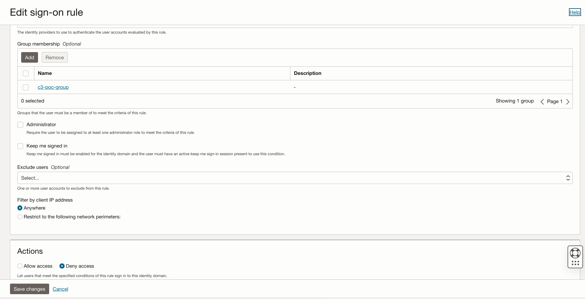
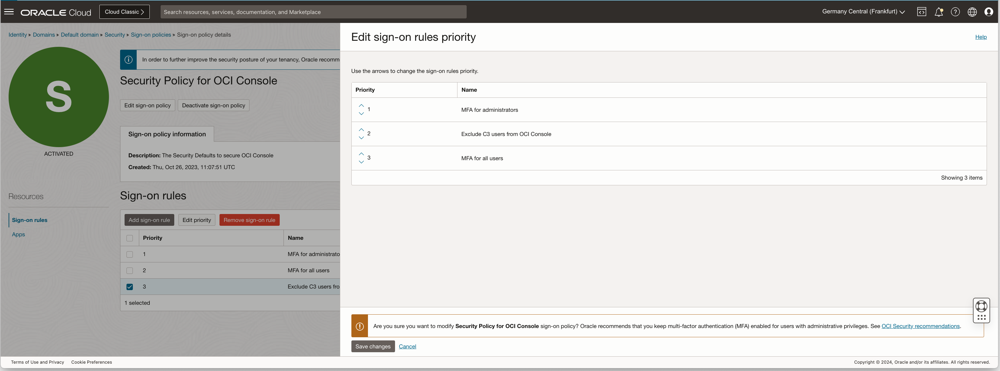

# C3 Hosting Service Provider - Restricting Access to the OCI Console

Reviewed: 16.10.2025

In the Hosting Service Provider (HSP) scenario where end users are not employees of the rack operator it's probably not appropriate for them to be able to access the OCI console and to, possibly, create resources in the public cloud.

In an OCI tenancy using Identity Domains, i.e. all new tenancies, then
there is an option to use [IAM Sign-On Policies](https://docs.oracle.com/en-us/iaas/Content/Identity/signonpolicies/managingsignonpolicies.htm#understand-sign-policies)
to prevent access to the OCI Console. There is a [specific Sign-On
Policy that controls access to the OCI Console](https://docs.oracle.com/en-us/iaas/Content/Identity/signonpolicies/managingsignonpolicies.htm#understand-sign-policies__securitypolicy-console-signonpolicy) and adding a new Sign-On Rule will disable access. Note that all users of a C3 must be created in the **default identity domain**. The Security Policy for OCI Console sign-on policy is activated by default and preconfigured with Oracle security best practices. Once located a new Sign-On rule as below will deny access to a specifed group:  

Once the new Sign-On rule is created then it should be added to the Policy as shown, in this case before the MFA rule: 

Note!

Even with OCI console access disabled there are still "live" OCI users who will have access to create/delete/modify resources via teh API in the OCI tenancy as well as the C3 as the policies and compartments are common across both. It would be wise to further restrict the capability of these users as per
<https://docs.oracle.com/en-us/iaas/Content/Identity/users/edit-users-capabilities.htm>.   
  
Ideally a policy should be implemented that restricts permissions **only** to the C3, see [this](../iam-policies-for-isolation/README.md) note.

## License

Copyright (c) 2025 Oracle and/or its affiliates.

Licensed under the Universal Permissive License (UPL), Version 1.0.

See [LICENSE](https://github.com/oracle-devrel/technology-engineering/blob/main/LICENSE.txt) for more details.