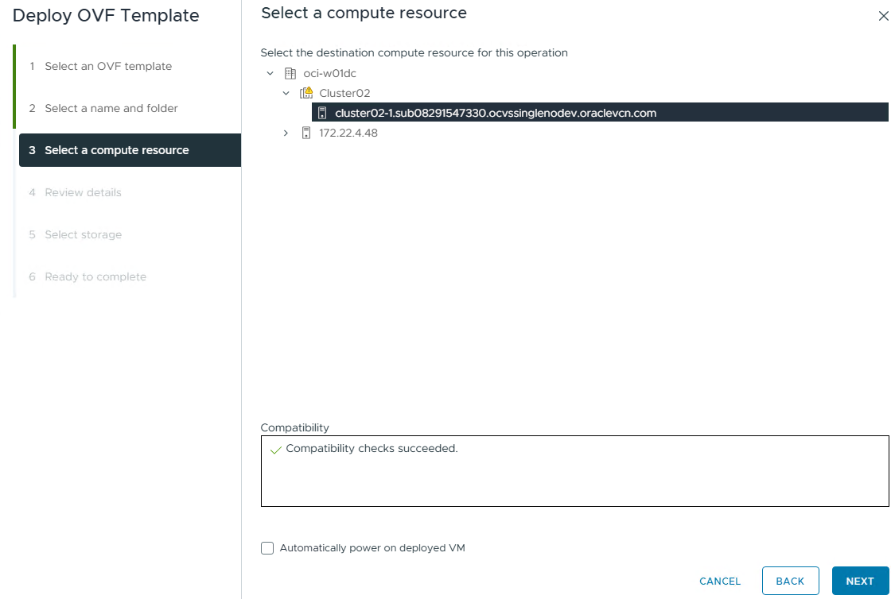
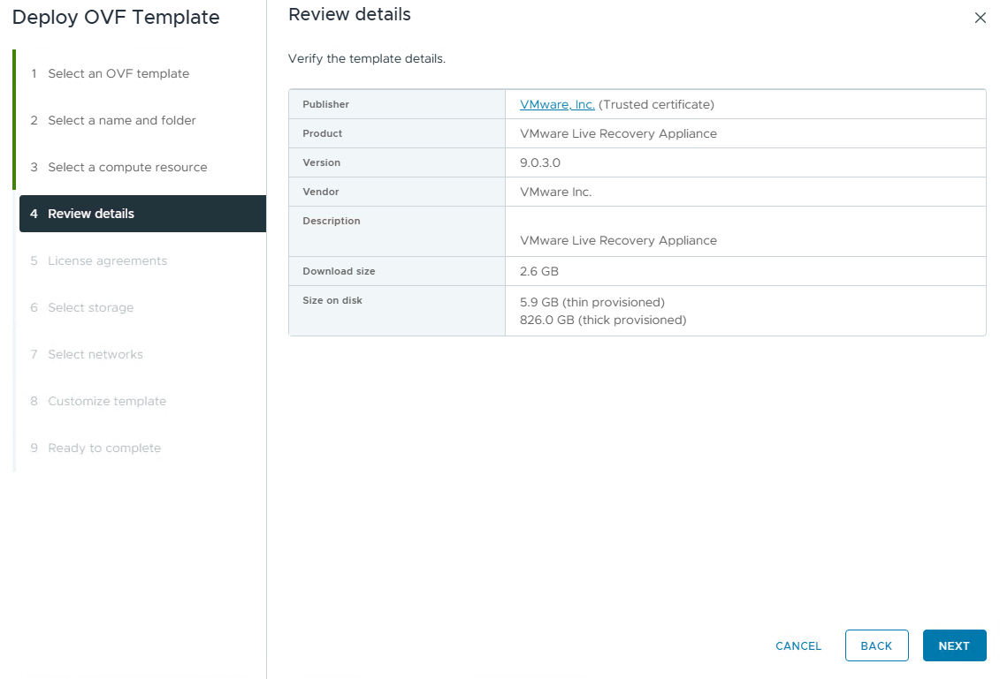
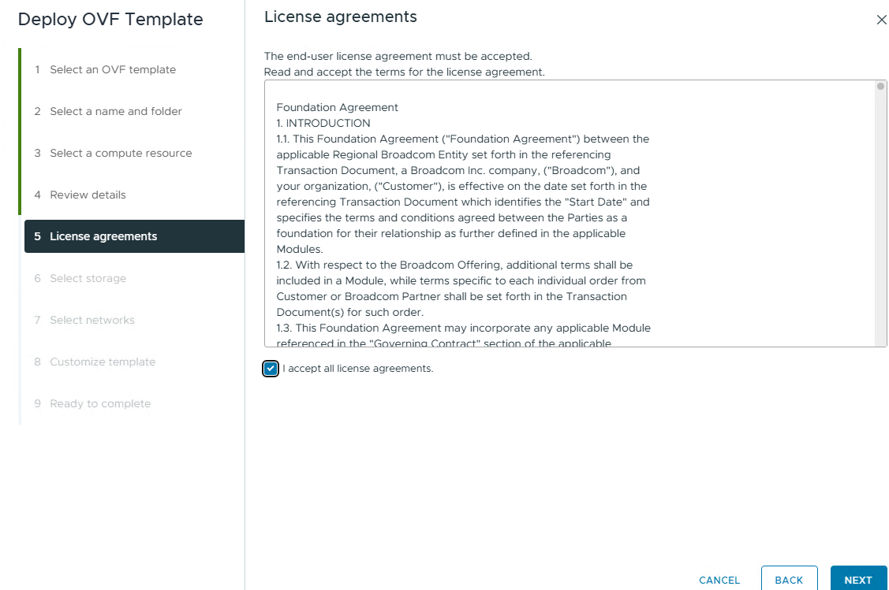
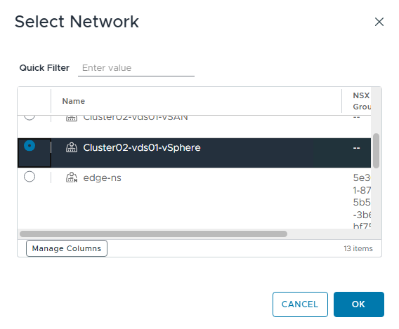
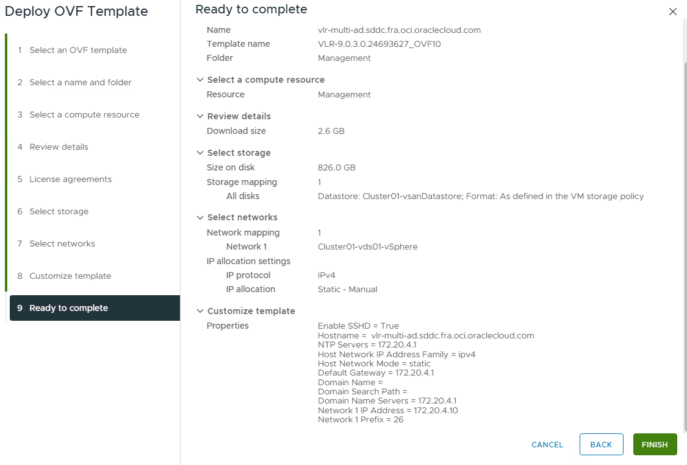
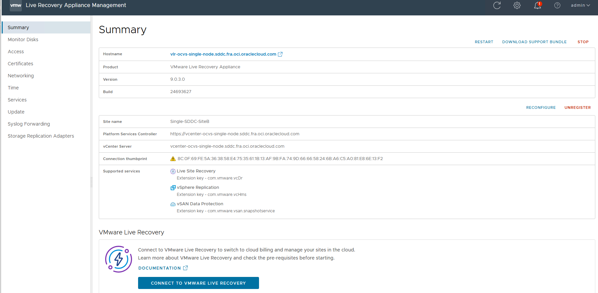

# VMware Live Site Recovery (9.x) Configuration and Deployment Guide

### Introduction

VMware Live Site Recovery (formerly VMware Site Recovery Manager) provides simplified disaster recovery orchestration and testing for workloads running on VMware environments. It integrates tightly with the VMware stack within OCVS, to deliver automated failover, failback, and non-disruptive recovery testing. 

When the product was called Site Recovery Manager (SRM), it worked with a separate product called vSphere Replication (VR). vSphere Replication was essentially a free product that replicated VM data, Site Recovery Manager helped orchestrate the failover and failback and testing of the VMs. So both products would come together to give you a fully fledged DR solution for your VMware environment.

Now with VMware Live Recovery (VLR), vSphere Replication is still a standalone product that can be used, but when you install VLR the appliance includes VR already saving you the additional steps of deploying it separately.

## Prerequisites

Before starting, ensure the following:

- **Protected and Recovery Sites** are deployed and are working correctly.

- **vSphere Replication** is configured between sites.

- You understand the type of  **network mappings, folder mappings, and resource mappings** you will need.

- You have sufficient **permissions** in vCenter/VMware Live Site Recovery.

- An application or VM is already configured for replication (if not please follow the documentation on VR) 

Before you can use the product it needs to be deployed at both sites and paired between sites. which is what we will cover first.

## Deploying VMware Live Recovery Appliance.

When you access the VMware/Broadcom portal you will be able to download the Live Recovery ISO file.

This then needs to be mounted on a jump box that has access to the local vCenter.

In the vCenter right click on the cluster object and select **Deploy OVF Template** 

Now select the **Local File**

**The VLSR iso needs to be mounted, and inside the iso there is a bin folder which contains the required files.** 

Now select the file files from the bin folder

Now work through the rest of the steps as shown in the screenshots

Select which compute resource the OVF will be deployed into

Confirm the details of the appliance

Accept the license agreement

Select the storage the OVF will be deployed onto

Select the VDS/VSS network the appliance will use once deployed

Configure the appliance, including all passwords, DNS/NTP etc.

Once it has been deployed you can power it on and if everything has been done correctly you will be able to login to its management interface, https://applianceIP/FQDN:5480 and you will be presented with the option to configure the appliance further

This is where you have to pair it to the local vCenter (Configure Appliance) with a login that meets the requirements (in most cases customers use adminsitrator@vsphere.local or similar)

Once that has been done, you will be presented with the following screen

You will then see the VMware Live Site Recovery Plugins be deployed into the vCenter

This will then take you to the Live Recovery Landing page, which will confirm the status of VLR in general for the site

Once you have selected **OPEN VMware Live Site Recovery** you will be shown the current Site Pair, this will allow you to use vSphere Replication within the same vCenter, for example if you wanted to protect VMs between clusters.

Now we have confirmed that this is working as expected, we can now repeat the process at the Recovery Site.

Once that has been completed we can continue from the source site and create a **New Site Pair**

You will now be asked to pair with a vCenter in the same SSO domain or in a different SSO domain. **In most cases it will be a different SSO domain.**

Now enter in the credentials of the remote vCenter Server 

You will have to accept the TLS certificates

It will then confirm that the site you are pairing with has its own instance of VLSR/VR

Now confirm you are ready for the pair to complete

If you have ever used VR on its own, you will recognise this is a very similar process.

You will now see that there are 2 pairings visible

The first is the pairing between our 2 SDDCs, while the other is a the local pairing allowing for replication within the same site/vCenter

After selecting **View Details** you will be presented with the VLSR overview, you will be prompted for the login details for the remote site

Key things to note with this new version is that, when you select **Replication Servers** you will see the ESXi hosts listed at each site. As with v9.x the ESXi communicate with each other directly for replication purposes using the Enhanced Replication feature by default.

Enhanced Replication requires that the ESXi hosts at both sides can communicate with each other directly, and the replication data between hosts is encrypted by default. Currently with OCVS vmk3 on each ESXi host is configured for replication, but does not have its own TCP/IP stack and this create a problem.

You have 3 options:

- Disable vSphere Replication on vmk3 and enable it on vmk0 which is also for management. This is the preferred option, as this will allow it to be routable. as long as the route table and NSG in the OCVS VCN allow it to be. Enhanced Replication is encrypted by default between the host at the source and the host at the destination so there is no need to worry about the data in transit, there should also be no bandwidth worries either as OCVS hosts have either 25/50/100Gb network adaptors.
- Create a new TCP/IP stack on every host for Replication. This would allow the VR traffic to be routable as well. Follow this [article](https://techdocs.broadcom.com/us/en/vmware-cis/vsphere/vsphere/8-0/vsphere-networking-8-0/setting-up-vmkernel-networking/create-a-custom-tcp-ip-stack.html)
- Use static routes on each ESXi host - This will force VR traffic to follow a specific route. Follow this [kb](https://knowledge.broadcom.com/external/article/308786/configuring-static-routes-for-vmkernel-p.html)

**Also Enhanced replications require TCP network connectivity on ports 31031 and 32032 from the ESXi hosts on which the replicated VMs are running to the ESXi hosts of the cluster containing the target datastore. Make sure your route tables and NSGs in the OCVS VCN are configured accordingly and the same is done for on prem (if required).**

**For further port connectivity info please visit [vSphere Replication - VMware Ports and Protocols](https://ports.broadcom.com/home/vSphere-Replication)**

You are now able to do performance tests between sites, to see the status of the connection and basic performance metrics

### Resource Mappings

The key thing about VLSR and how it helps handle DR failovers, is with the use of **Resource Mappings**. This allows VLR to failover VMs and know exactly where to place them at the destination site during the failover process.

We will now go through and create the Network Mappings

You have the ability to let it auto configure them for you to save time

As you can see here, it has auto populated the most obvious ones, but you are able to edit/amend as required

It can also populate the reverse mappings. The reverse mappings are for when you want it fail back to the primary site after the DR event is over. So VLR knows where to place the VMs on the return trip. Normally this would just be an exact mirror of what the original mappings were, but there may be use cases where this may not be the case.

We will now move onto the Folder Mappings

Its a very similar process to the Network Mappings we did earlier

Now we do the same thing but for the Host Resource Mappings

If you are using VSAN you can do the same thing for VSAN Storage Polices as well.

### Placeholder Datastores

Part of the initial configuration process is to select **Placeholder Datastores**, these can be tiny dedicated datastores or can use existing datastores at either site. The goal is to for these placeholder datastores to hold the placeholder configuration data for the VMs being replicated, not the actual replicated data themselves.

In this example we will be removing one of the datastores so that VLSR can not use it for placeholder information. We are not deleting it from vCenter or anything like that, we are just removing it as a selection option for VLSR to use.

[Select a Placeholder Datastore](https://techdocs.broadcom.com/us/en/vmware-cis/live-recovery/live-site-recovery/9-0/how-do-i-protect-my-environment/about-placeholder-virtual-machines/configure-a-placeholder-datastore.html) For further information 

## Configuring Replications

Now lets configure some replications quickly using vSphere Replication

Select the VMs you would like to replicate

Pick target Datastore

Test connectivity between replication hosts

Configure the RPO

You now have the option to create a Protection Group now or later (we will do it later)

You will now see the VMs being replicated int he VLSR dashboard

## Protection Groups

The next thing to consider is **Protection Groups**

Protection Groups are about placing VMs together in a logical container so they are considered as one group. This is normally done when VMs in a certain App would be best failed over together, or VMs in the same VLAN could be in the same Protection Group

https://techdocs.broadcom.com/us/en/vmware-cis/live-recovery/live-site-recovery/9-0/how-do-i-protect-my-environment/creating-and-managing-protection-groups.html

You can pick the direction that the Protection Group will work in, as some customers will have VMs at Site A they want to failover to Site B and VMs at Site B they want to failover to Site B (a more active/active approach)

We are using vSphere Replication within OCVS

If replications have been configured correctly you will see the option below showing all the VMs currently being replicated for you to add as required

 

**If you see a screen showing ZERO VMs, it means you have not actually configured vSphere Replication to Replicate any VMs.** This needs to be done first otherwise there are no VMs to add into the Protection Group.

You now have the option to create a Recovery Plan now or later ( we will create this later)

## **Recovery Plans**

A recovery plan functions as an automated runbook that orchestrates the entire recovery process. It defines the sequence in which VMware Live Site Recovery powers on and shuts down virtual machines, assigns network settings to recovered VMs, and manages other key operations. Recovery plans are highly configurable to meet specific requirements.

Each recovery plan is built around one or more protection groups. A single protection group can be referenced by multiple recovery plans. For example, you might have one plan for a full organizational migration and additional plans tailored to specific departments. This structure allows flexible recovery workflows using the same underlying protection groups, enabling different recovery scenarios without duplicating configuration.

https://techdocs.broadcom.com/us/en/vmware-cis/live-recovery/live-site-recovery/9-0/how-do-i-protect-my-environment/creating-testing-and-running-recovery-plans.html

**Only a single Recovery Plan can be run at any onetime**

### Creating a Recovery Plan

Select **New Recovery Plan** 

Give the Recovery Plan a name

Select the Protection Group(s) you would like to be contained within the Recovery Plan

Here you can select what networks will be used when you run a **test**. When doing DR tests customer usually like to attach the VMs to a custom network or use isolated networks to ensure that the VMs do not conflicts with live production systems

Select **Finish**

You will now see the new Recovery Plan created and listed

#### Modifying a recovery plan

Recovery Plans can be edited and there are a multitude of options to help configure the recovery process

Further details can be found here:

https://techdocs.broadcom.com/us/en/vmware-cis/live-recovery/live-site-recovery/9-0/how-do-i-protect-my-environment/configuring-a-recovery-plan/recovery-plan-steps.html

### Running the Recovery Plan

Select the Recovery Plan you wish to use and select **Run** or ***Test***

#### Test

In our example we will be running a test

You have the option to replicate recent changes, depending on your RPO schedule and last replication cycle for the VMs, this could take some time.

Select **Finish**

When you check in the destination sites vCenter, you will see that the VM(s) have been recovered, and they are attached to an isolated port group

In VLSR it will show the Test as being complete

Once you are happy that the test can be cleared down, in the VLSR console you can select **Cleanup**

The Recovery Plan will be put back into a ready state.

#### Run Failover

In this example we will run the actual Recovery Plan, just like if we were going to run it in a real live DR scenario.

The key difference between a Planned Migration and Disaster Recovery options are:

- Planned Recovery assumes that the source site is still up and running and data can still be replicated, and if any errors happen it will halt the process. 

- Disaster Recovery assumes the source site is down and it will still try to replicate recent data but if it cant, it will continue on regardless of errors.

As you can see the VMs have been powered on as part of the Recovery Plan execution and the network for the VM vnic is detached, this is how the Recovery Plan was set to run and how my mappings were configured in the earlier steps.

In the VLSR console you can inspect the recovery steps

You will see that the recovery process has completed

#### Reprotect

After you have failed over, the DR site has become the Primary Site and the original site is now going to be the classed as the Recovery Site.

The VMs need to be protected again and replication needs to be reversed to ensure the recovered VMs are protected again.

Reprotect reverses the direction of protection using the configuration defined prior to the original recovery. **This process can only be initiated once the recovery has completed successfully without errors. If any errors occur during recovery, they must be resolved and the recovery rerun until it completes cleanly.**

**If you did a full DR failover, once the original site is available a gain, you must run a Planned Migration operation, so VSLR at both sites, is fully in sync and all errors have been resolved.**

During reprotection with vSphere Replication, VLSR leverages the original VMDK files as seed copies. The full sync phase primarily involves checksum validation, resulting in minimal actual data transfer over the network.

Initiating synchronization from the new protected site to the new recovery site ensures the recovery site holds an up-to-date copy of the virtual machines. This guarantees that recovery operations can begin immediately once reprotect completes.

If you need to configure reverse replication manually, use the VMware Live Site Recovery UI to force-stop the incoming replication group on the former recovery site (now the protected site). Avoid deleting the VM from the original protected site, as doing so will cause reprotect to fail.

After reprotect is complete, you can run tests to validate that the updated configuration between the protected and recovery sites is functioning as expected.

Depending on the state of the original/primary site this process may not be possible for a while, you just have to understand that the newly recovered VMs will be unprotected for this period

Once the reprotect operation has been completed, the Recovery Plan will be ready to use. You can run Test and Failover operations as normal 
