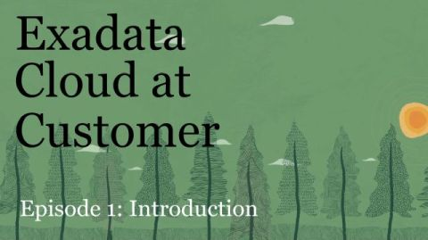
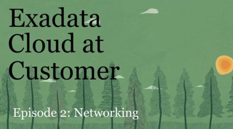
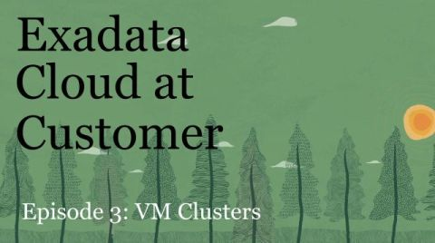
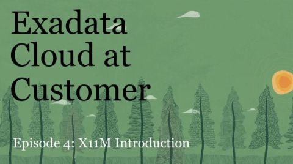

# Exadata Cloud@Customer Value

Reviewed: 28.02.2025

# Videos
A short video series covering different aspects of the Oracle Exadata Cloud@Customer - the best platform for running your Oracle Databases in the cloud behind your firewall.

**Episode 1 - Introductions to Exadata Cloud@Customer:**

**Episode 2 - Exadata Cloud@Customer Networking:**

**Episode 3 - VM Clusters on Exadata Cloud@Customer:**

**Episode 4 - Exadata Cloud@Customer X11M Introduction:**

**Episode 5 - Autonomous Database on Exadata Cloud@Customer:**

The below videos are showcasing best practices and how-to's with a technical and hands-on approach.

**Learn how to optimize Exadata Database Service performance using IORM (I/O Resource Manager):** 

# Useful Links

- [Public Cloud Service Descriptions - (ExaDB-C@C Infrastructure)](https://www.oracle.com/assets/paas-iaas-public-cloud-2140609.pdf)

- [Service Level Objective (SLO) for ExaDB-C@C - Category 6](https://docs.oracle.com/en-us/iaas/Content/General/Reference/servicelevelobjectives.htm)

- [Oracle PaaS and IaaS Universal Credits Service Description](https://www.oracle.com/oce/dc/assets/CONT66B9F94D4751422F8C46B87B9FECB5B1/native/oracle-paas-and-iaas-universal-credits-service-descriptions.pdf)

# License

Copyright (c) 2024 Oracle and/or its affiliates.

Licensed under the Universal Permissive License (UPL), Version 1.0.

See [LICENSE](https://github.com/oracle-devrel/technology-engineering/blob/main/LICENSE) for more details.
