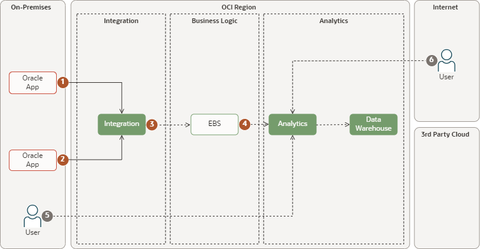
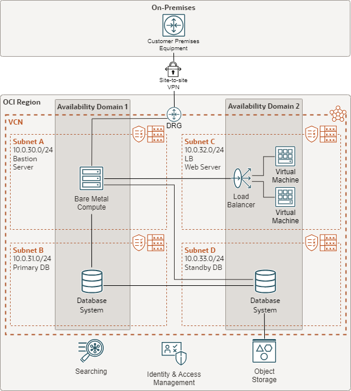
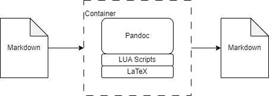

# Authors

| Name          | eMail | Role                             | Company |
|:--------------|:------|:---------------------------------|:--------|
| Andrew Bond   |       | CTO and Specialist Leader        | Oracle  |
| Omer Ijaz     |       | Field Chief Technology Architect | Oracle  |
| ${doc.author} |       | Best Practices Leader            | Oracle  |

# History

| Version | Authors       | Date               | Comments                                                                   |
|:--------|:--------------|:-------------------|:---------------------------------------------------------------------------|
| 1.0     | Alexander Hodicke | 27th February 2024 | Created the firt version, with 'Tooling with Markdown and DrawIo'          |
| 1.1     | Omer Ijaz     | 29th February 2024 | Added 'Solution Documentation and the Oracle Solution Definition Template' |

# Solution Documentation and the Oracle Solution Definition Template

The Solution Definition Document (SDD) is a key deliverable within the Cloud Delivery Framework (CDF), which guides the implementation strategy from early sales stages. The CDF provides guidelines for selecting the right implementer, enabling collaboration among various roles including Sales, Technology Solution Engineering, A&C, OCS & CSS. It emphasizes strong alignment across the ecosystem to accelerate customer success and consumption. The framework delineates responsibilities for each role, encouraging collaboration to ensure successful implementations.

The SDD allows us to deliver high-quality solutions swiftly while complying with architecture best practices and standards, ensuring seamless information exchange with internal and external partners, and minimizing re-work post contract signature.

The SDD values revolve around the following areas.

**Architecture Best Practices and Standards**

Oracle emphasizes adherence to established architecture best practices and standards to ensure the reliability, scalability, and maintainability of solutions. Customer documentation detailing these practices and standards serves as a reference point for design and implementation teams.

**Information Exchange Mechanism**

The SDD becomes the de-facto tool for information exchange as it is seamlessly shared between Technology Engineering and Implementation partners (internal or external).

**Rapid Solution Design and Delivery**

We embrace agile methodologies and iterative development approaches to expedite the solution design and delivery. The SDD allows for rapid prototyping, feedback loops, and incremental improvements to accelerate the time-to-market for solutions.

**Implementation-Ready Solution**

The solutions are designed with implementation considerations in mind from the outset. Implementation teams can then derive their design documents based on the information shared in SDD.

**Avoidance of Re-work**

Measures are taken to minimize re-work, such as comprehensive initial discovery workshops to capture requirements accurately. Continuous feedback loops and stakeholder engagement help identify and address potential issues early in the development process, reducing the need for re-work.

In addition to the SDD base template, there are workload-based SDD templates covering (but not limited to) Oracle applications, custom applications, database consolidation, cloud native technologies, WebLogic, serverless lake house, VMware, Multicloud and other solutions.

# Tooling with Markdown and DrawIo

We believe that the quality of our work and the products we sell are reflected and supported by professional documentation for our customers and partners alike. To elevate the quality of our documentation, the Technology Engineering organization decided to standardize the content via a template and the consistency of the look and feel of the resulting assets by using Markdown and supporting technologies. We want to ensure that customers' experience working with us and with our documentation is as identical as possible. We want the reader to recognize our structure, and to know where to expect what content. So between two different projects, both documented in the same structure and style, consistency can help improve the readability of the document.

Every customer documentation fundamentally consists of three different types of content: written text, solution architectures in diagram form and other pictures.

## Solution Architectures in Diagram Form

To draw architecture diagrams, we use DrawIO. It is an easy-to-use tool to draw all kinds of different diagrams or flow charts. We use our notation and iconography to represent an Oracle solution. Other standards are by default supported such as UML, BPMN and others. You can find the DrawIO libraries as well as PowerPoint templates for our notations as well as the icons on the [OCI Architecture Diagram Toolkits](https://docs.oracle.com/en-us/iaas/Content/General/Reference/graphicsfordiagrams.htm).

We created two different styles for our notation. A logical style and a physical style, inspired by the original definitions by Zachman for [conceptual, logical, and physical system designs](https://zachman-feac.com/resources/ea-articles-reference/149-conceptual-logical-physical-it-is-simple). The logical notation represents a business point of view with user and data flows between capabilities or processes, instead of technology products. This view is more abstract and is very business-friendly. It can include technical generic capabilities such as 'integration', if required. The creator of a diagram needs to understand the audience and the purpose of the diagram, thus a logical notation can focus on business concepts only or somewhat bridge the gap to a technical view if needed.

<!--  -->



On the other hand, the physical notation describes the final technical solution. It includes physical things, such as hard- or software components or networking details. It describes a system and what components are needed for a full implementation of the system.

<!--  -->



The physical notation includes also a set of icons for different Oracle products, as seen in the image above.

We especially appreciate two features of DrawIO. The first is the ability to use layers. Layers allow us to mask the complexity of diagrams and to reveal layers for certain viewpoints. It allows us to tell a story while gradually explaining the solution holistically. It is a great tool to communicate complicated solutions. The second is the ability to export to PDF files. Diagrams exported in DrawIO to PDF are scalable vector graphics that result in sharp and great-looking images in the final documentation. Example: The images above can be zoomed in and will always stay sharp, whereas PNGs and JPEGs are bitmaps and will result in a pixelated unreadable image if you need to zoom into it.

## Written Text in Markdown

Markdown is a markup language used in technical writing within various blogs, technical solutions or Git repositories.

Markdown allows us to write our documentation almost like code, with various advantages but also some disadvantages. The approach is called 'documentation as code'.

We shifted to a Markdown documentation-as-code style approach, because of the level of consistency we want to achieve with our documentation. With Markdown we can strictly enforce the formatting of a document. In other solutions such as Word, the consistency of the look-and-feel will suffer if every author has the freedom to format the document to their liking. In Markdown, an author specifies with tags the format of a certain text, but can't change the formatting of it. Thus a 'header' is defined once, and everyone wanting to use a header needs to follow that formatting when using the header tags.

Here is a short example of a Markdown code:

    # Header

    This is a normal chapter. **This is bold**. *This is italicized*.

    - A
    - bullet
    - point
    - list

As this document is also written in Markdown, these examples translate to (without the header):

This is a normal chapter. **This is bold**. *This is italicized*.

-   A
-   bullet
-   point
-   list

Using Markdown in an organization will incur two challenges. First, you need to format the PDF export of a Markdown document, to suit your corporate branding, with things like fonts and logos. Second, users will need to shift their behaviors from using a 'What you see is what you get' editor like Word, to a more codified approach with back-and-forth steps of 'debugging' to create branded PDF outputs of your document.

### Markdown Solution and Features

For the first challenge, we developed an internal tool, based on public open-source components, to translate a Markdown file into a branded PDF. The solution is based on [Pandoc](https://pandoc.org/) and [`\LaTeX`{=tex}](https://www.latex-project.org/) in the backend, while the user only writes Markdown. Languages such as HTML and `\LaTeX `{=tex}can also be used in the text if desired. On top of that, we developed some LUA scripts as a filter for Pandoc, which allows us to create and resolve variables that a user can define in a YAML metadata block. These variables can also be used to load pieces of text per condition like an If-Else statement. With that, we can easily define a variable for a customer name and switch a template from one customer to another. Or we can use a piece of text if a condition is true, such as 'high-availability = true'. Furthermore, we can convert multiple Markdown files into a single PDF output. This allows us to have a single main document, and maybe some chapters as an individual document shared between different team members if needed, or specific text block highly reusable shared between all users, such as disclaimers, safe harbor statements, product descriptions etc. Such snippets can then be centrally managed and updated, with the end users just retaining the reference to the snippets, not needing to update their documents.

<!--  -->


Here are some examples of such a document, with the use of variables and snippets:

The metadata for this document includes the title page and author information.

    ---
    doc:
      author: Alexander Hodicke
      version: 1
      cover:
        title:
          - Oracle Technology Engineering
          - Specialists Best Practices
        subtitle:
          - Solution Documentation
    ---

Calling a variable, in the definition of the author information in the metadata.

      team:
        - name: ${doc.author}
          email: 
          role: Best Practices Leader
          company: Oracle

Automatic content creation for the authors of a document, based on YAML metadata.

    # Authors

    ```{#team}
    ```

Loading predefined acronym lists or snippets for reusable texts.

    ## Abbreviations and Acronyms
    ```{#acronyms}
    common
    data-lake
    ```

    ## Document Purpose
    ```{.snippet}
    uc-document-purpose
    ```

### Adoption and Benefits

For the second challenge, the adoption of such technology is not easy, and either needs a confident management push and belief in this approach or could be built bottom-up with cross-pollination of best practices tools and processes between smaller teams.

Next to the consistency of our documentation, other benefits can be leveraged as well such as the automation of the documentation, solutions wizards, and distributed text snippets to ensure up-to-date and consistent content. In addition, Markdown can also be exported to Word, which allows us to maintain our templates purely in Markdown with all the benefits of variables and snippets, but then export them to Word into a static document for Word-friendly users. In Oracle, we are still on our way to fully realizing all the benefits of a documentation-as-code approach. In FY 2022 100% of documents created with Markdown were perfectly consistent, and 85% of all documents of our organization were created that way. We already see the consistent use of certain solution patterns such as 'Landing Zones' in our document, ensuring always the use of the latest version of that pattern. We also can apply scripts to a standardized document, to automate and shorten the implementation tasks. Currently, we can export Terraform scripts from our customer documentation.
