# Generation of Securty Alarms from OCI logs

Oracle Cloud Infrastructure (OCI) and services provide effective and manageable security that enables you to run mission-critical workloads and store your data with confidence. To achieve cloud security operational excellence, it is crucial to continuously protect, detect and in the event of a protentional risky configuration change or potential attack, respond. For protection of the environment, a string security posture and essential cyber hygiene practice is imperative.
  
Creating alarms to be passed to the security responsible organization or individuals are a key requirement to be able to early detection of a Advanced Persistent threat type of attack. 
  
# Security Protection, Detection and Response
  
 A common set of best practises for protection, detection and response are:
-	Security posture management. Oracle Cloud Guard provides strong security posture management, configuration change management, threat intelligence and unsecure configuration detection and remediation.
-	Security monitoring. For our customers navigating the dynamic cloud security landscape without a dedicated Security Information and Event Management (SIEM) system, the Security Fundamentals Dashboards are set to support our customers in building and maintaining strong security monitoring, observability and governance around the OCI cloud. The Security Fundamentals Dashboards proactively aggregate and analyse OCI logs.
-	Centre of Information Security, CIS, [CIS Benchmark for Oracle OCI](https://www.cisecurity.org/benchmark/oracle_cloud). The CIS benchmark builds a foundation for minimum protection and detection of your OCI tenancy. Oracle Cloud Guard providers detectors for the CIS Controls related to protection.
-	Security metrics and alerts. With Oracle metrics and alarms, you may configure alarms that is triggered, and notifications created when an security related metrics exceeds a threshold. For configuration changes, Cloud Guard provides standard responders for notification in the event of unsecure configuration changes.
  
The scope of this post is to show how the Security Fundamentals Dashboard can be enhanced with alarms and notifications.


In the example, egress traffic peak value, from the production VCN, will be used as an example. For data loss prevention, monitoring a flux or massive egress traffic can be created as a detective security control.  
As a security foundation the following minimum are recommended
- Ensure Cloud Guard is enabled and configured. It is not a requirement for SFD, but it is common best practice, and any organization is recommended to actively use Oracle Cloud Guard. It is included in your subscription; no additional cost incurs.
  
[Cloud Guard Documentation](https://docs.oracle.com/en-us/iaas/cloud-guard/using/part-start.htm)
-	Revisit CIS Benchmark for OCI at: [https://www.cisecurity.org/benchmark/oracle_cloud](https://www.cisecurity.org/benchmark/oracle_cloud)
-	Deploy Security Foundation Dashboard. After the few initial prerequisites, like enabling a VCN Flow log, the dashboard is built as a terraform script, that can be run directly as a stack. 
  [Security Fundamentals Dashboard on GIT](https://github.com/oracle-quickstart/oci-o11y-solutions/tree/main/knowledge-content/MAP/security-fundamentals-dashboards)  

Below are a few samples from the Security Fundamentals Dashboard
  


Sample of Security Fundamentals Dashboard, identity
  


Sample of Securtity Fundamentals Dashboard, network.

# Implementation flow
  
The building blocks and flow for security alarm creation are:
- OCI Observability and Logging, with Logging Analytic
Ingest OCI Flow Logs into log analytics, and use log analytic explorer to create a query. The query may be run at ingestion time or at a scheduled interval. The query is saved as a custom log explorer query.
The Security Fundamentals Dashboard automatically creates the ingestion from OCI Logging. Please review the [Documentation on GIT(https://github.com/oracle-quickstart/oci-o11y-solutions/tree/main/knowledge-content/MAP/security-fundamentals-dashboard)]

- OCI Metric services, detection rules
The query result can be defined as a custom metric, by defining a detection rule on the saved query. In the example below the detection rule is run at a scheduled interval.  
- Create a OCI Notification service. The Notification service creates a subscribeable Notification Topic. The topic is fired when an alarm threshold is exceeded.
- OCI Metric Alarm triggers a notification based on a threshold
  
# Required policies

There are two set of policies that needs to be defined:
- Policies for enabling the Security Fundamentals Dashboard
- Policies for enabling a detection rule

The policies for the Security Fundamentals Dashboard, please refer to the [documentation](https://github.com/oracle-quickstart/oci-o11y-solutions/tree/main/knowledge-content/MAP/security-fundamentals-dashboard)

The policy definitions for detector rules, which requires a dynamic group, are defined in the [documentation](https://docs.public.oneportal.content.oci.oraclecloud.com/en-us/iaas/logging-analytics/doc/create-schedule-run-saved-search.html#GUID-A37A3F93-BE74-4850-859D-C8D293781036)  
Below is an example of dynamic group membership rule and policies enabling detection rules:

```
ALL {resource.type='loganalyticsscheduledtask'}
```

Example root level policy definition
  
  ```
  
allow dynamic-group myloganalytics-detection-group to use metrics in tenancy
allow dynamic-group myoganalytics-detection-group to read management-saved-search in tenancy
allow dynamic-group myoganalytics-detection-group to {LOG_ANALYTICS_QUERY_VIEW} in tenancy
allow dynamic-group myoganalytics-detection-group to {LOG_ANALYTICS_QUERYJOB_WORK_REQUEST_READ} in tenancy
allow dynamic-group myoganalytics-detection-group to READ loganalytics-log-group in tenancy
allow dynamic-group myoganalytics-detection-group to read compartments in tenancy
```
  
# Define custom metrics query

Navigate to the dashboard, and select one widget, in our case the egress widget. You will then see the log explorer of log analytics
-	Alter the query to accommodate your need, in the sample below, we look at MB egress pr. 10 min.
-	Save the modified query as a new query
-	Pull up the new query and add it as a metric.
  

Picture of Network dashboard
  
Expand Egress traffic widget expanded to log explorer


Piture of log explorer

Run the modfied query:
```
'Log Source' = 'OCI VCN Flow Unified Schema Logs' | where 'Destination IP' = 'Public IP' | eval vol = 'Content Size Out' / 1024 | timestats span = 10minute sum(vol) as 'Volume (KB)
```  
and save it.  

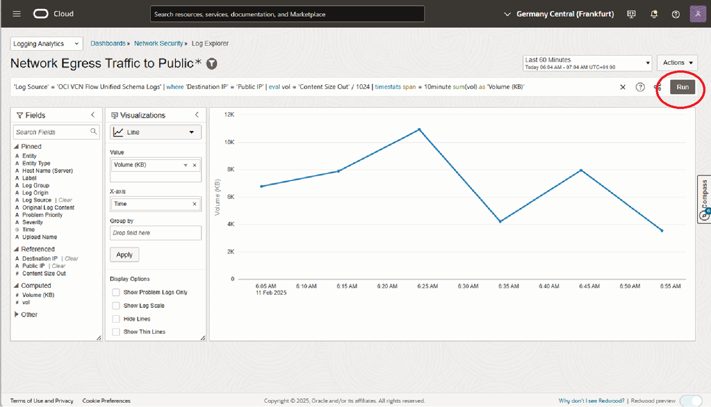
Picture of exection of modified query
   
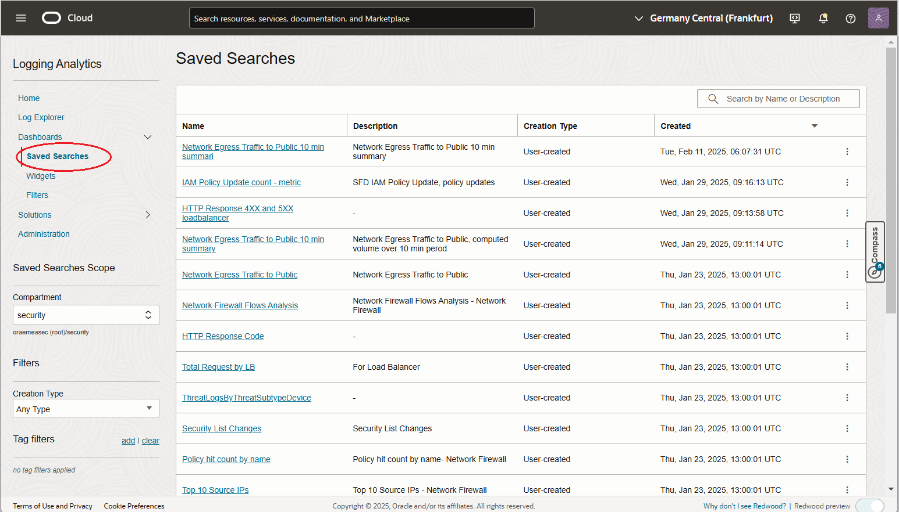
Picture of modified query 
  
# Create detection rule 
Navigate to log analytics, dashboard saved query, and pull up the saved query
  

Picture of saved query screen
  
Create the Detection rule. In the detection rule creation screen, select the folowing:
- "Scheduled Detection Rule" The method for running the log analytic query
- "Rule Name", self-describing
- "Saved search name", select the correct compartment and saved log analytics query for the metric
- "target service", select type monitoring (which the alarm are a function of), Metric namespace, name and frequency.
The metric namespace is either an existing customer namespace or a new one. The new one will be created if the namespace name is nonexisting. If this is the first alarm, create a new descriptive name, otherwise select an existing name, if you want to group several alarms in the same namespace. Minimum interval is 5 minutes, normally a good choice for security alarms.


Picture of first rule creation step


Picture of 2. step

When the detection rule is created verify the detection rule
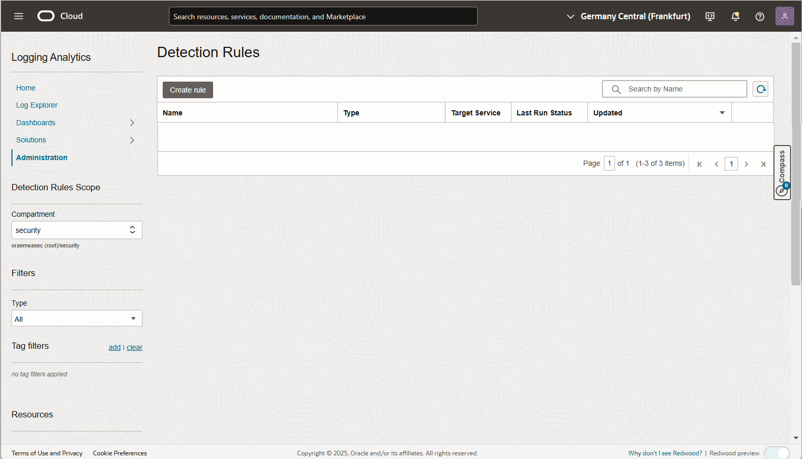
  


Picture of rule validation 

# Topic Creation

Topics are the transport of an alarm to a target and needs to be present before the alarm can be created. Topics are created under Notifications (Developer Services/Application Integration)

After the creation of a topic one or many subscriptions needs to be added, the receivers of the topic.
The topic creation is straight forward, as illustrated below. Navigate to ```Developer Series/Application Integration/Notifications```  

  
Topic creation, step 1  
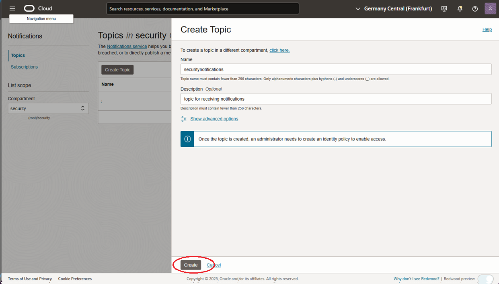  
Topic creation, step 2  
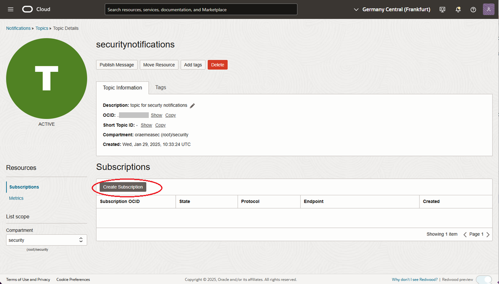  
Topic creation, step 3  

After the topic is created, a subscription is reasonable to create, the receiver of the alarm.
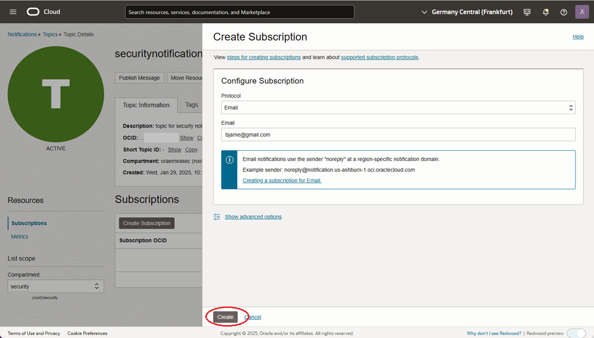  
Topic creation, step 4  
  
Topic creation, step 5  

When the subscription is created, the subscriber will receive an email with a link to a confirmation.  
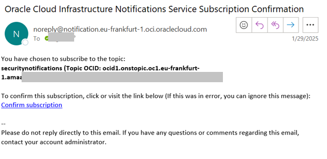  
Confiormation link mail, step 5 

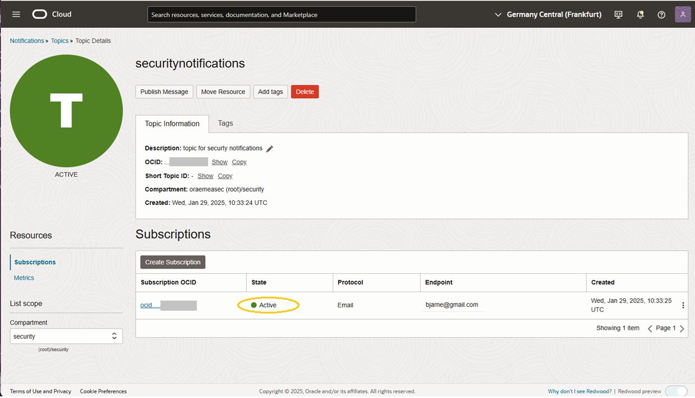  
Final status after successful confirmation of the subscription

# Define the alarm

The final configuration is to build a alarm.
The Alarm is defined under Observability and logging, in the Monitoring/alarm section:

The alarm require a metric, in a metric namespace, a threshold value of the metric and a notification topic to trigger when the threshold is exceeded.
The trick of the trade here is the fields:
- Metric namespace. This is the link back to the saved query/detection rule from above
- Interval, matches the query interval
- As dimension select saved search and dimension value, the name of the search.
- Statistics, select max(), the formula used to calculate the current value of the alarm
- Operator, greater than and the value 1000000

This will create an alarm that trigger if the last 5 minutes egress traffic exceed 1000000 bytes.

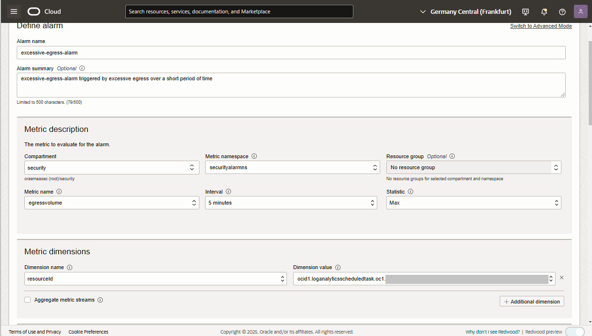
Alarm definition
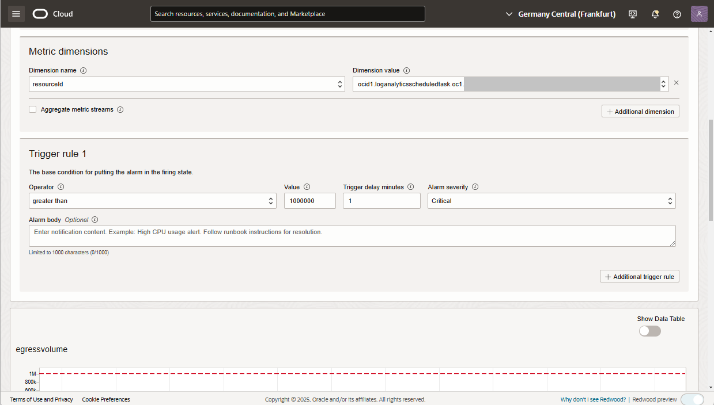
Alarm definition continued

Example of mail alarm received when the egress volume exceeds 1000000 bytes within 5 min. This might indicate a potential data loss.

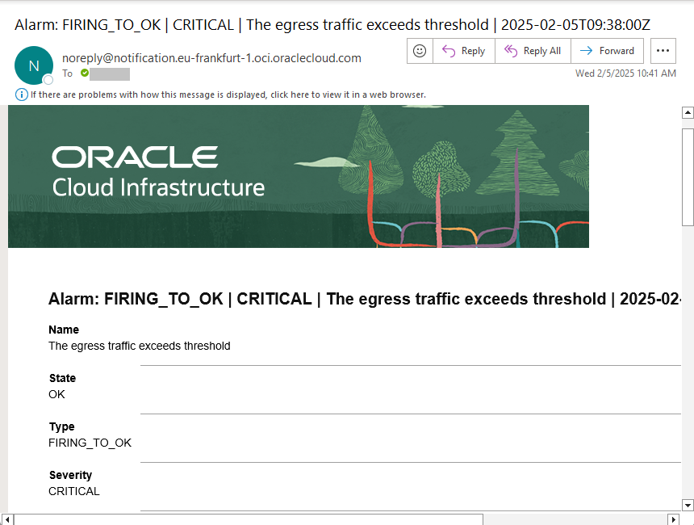

# Summary

In the post there has been show how a single widget in the Securty Foundation Dashboard can be enhanced to create a custom alarm on a custom metric.

The natural next step is to assess which alarms will be required based on your risk assessment, and with terraform create all the required alarms.
When the alarms are createrd, the real value lies in how you choose to respond to the events receved.


# License

Copyright (c) 2024 Oracle and/or its affiliates.

Licensed under the Universal Permissive License (UPL), Version 1.0.

See [LICENSE](https://github.com/oracle-devrel/technology-engineering/blob/main/LICENSE) for more details.
